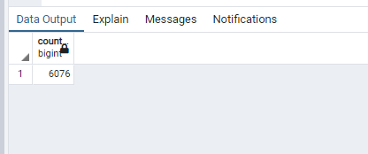
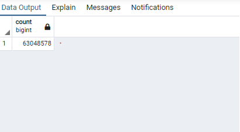

# Movies-ETL

## Project Overview

This project consists of creating one function that takes in three files:

-Wikipedia data
-Kaggle metadata
-MovieLens rating data

Then performs the ETL process by adding the data to a PostgreSQL database.

